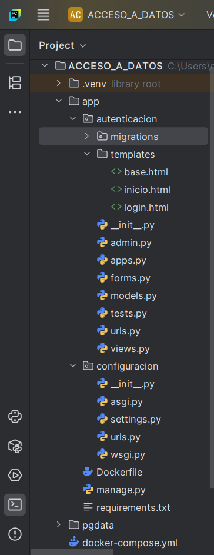
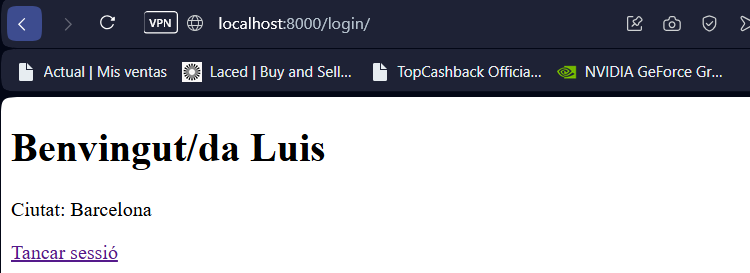
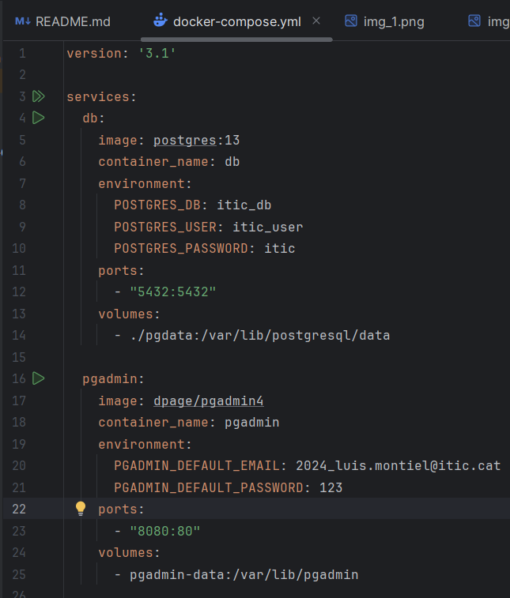
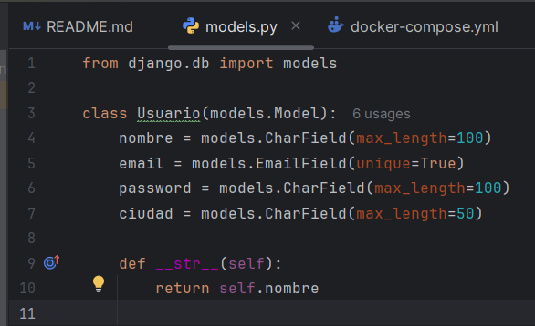
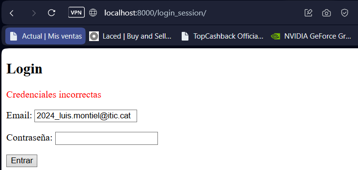
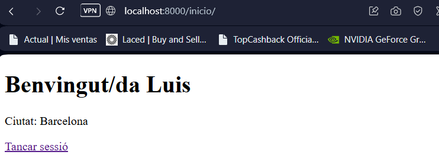
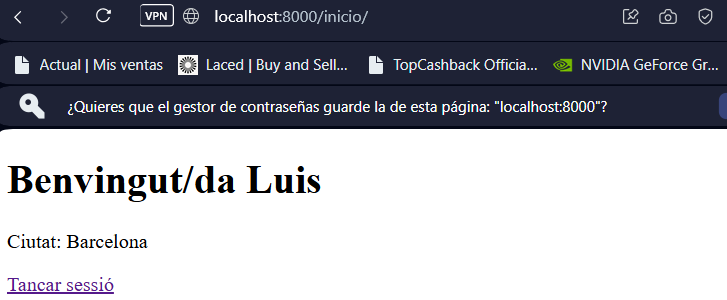
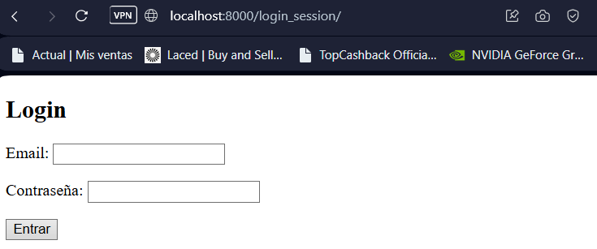
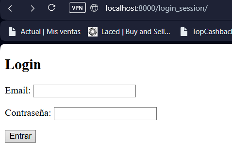
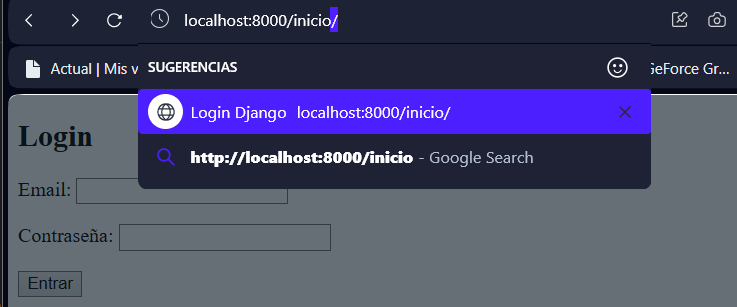

#  Proyecto Login con Django y PostgreSQL

## Tecnologías utilizadas

- Download Python 3.13.3
- Django 4.1
- PostgreSQL 13
- Docker y Docker Compose
- Pycharm Comunity Edition 2024.3.5


## Estructura del proyecto




## Funcionalidades

###  Login sin sesión
- Vista que recibe email y password.
- Verifica en la base de datos sin guardar estado.
- Si las credenciales son válidas, redirige a una página de inicio.
- Si no, muestra un mensaje de error.

###  Login con sesión
- Igual al login anterior pero almacena la `usuario_id` en `request.session`.
- Permite mantener la sesión iniciada hasta hacer logout.
- Redirige al login si intenta acceder sin estar autenticado.

###  Logout
- Borra la sesión activa y redirige al formulario de login con sesión.

###  Página de inicio
- Muestra mensaje de bienvenida con el nombre del usuario y un botón de cerrar sesión.


## Capturas de pantalla

### Formulario de Login


Código:
```html
<form method="post">
  
  {{ form.as_p }}
  <button type="submit">Entrar</button>
</form>
```

### Página de Inicio con sesión activa



Código:
```html
<h1>Benvingut/da {{ usuario.nombre }}</h1>
<p>Ciutat: {{ usuario.ciudad }}</p>
<a href="">Tancar sessió</a>
```

---

## Base de datos PostgreSQL





- Conectada mediante `docker-compose.yml`.
- Modelo `Usuario` con campos: `nombre`, `email`, `password`, `ciudad`.
- Campo `email` con `unique=True`.


## Pruebas realizadas

- Login sin sesión ( muestra error).

- Login con sesión (mantiene sesión abierta tras recargar).

- Logout (cierra correctamente la sesión).


- Acceso denegado a `/inicio/` si no hay sesión.



